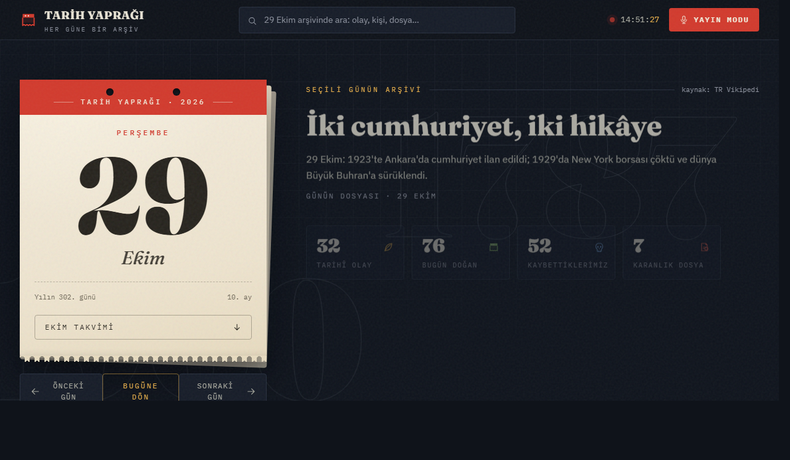

# Tarih Yaprağı

**Her güne bir arşiv.** Seçtiğiniz günün tarihteki karşılığını bir takvim yaprağının
etrafında toplayan, Türkçe, tamamen istemci taraflı bir masaüstü/web uygulaması.



---

## Ne yapar

Bir gün seçersiniz; uygulama o güne ait olayları, doğanları ve kaybettiklerimizi
Vikipedi'nin "Tarihte Bugün" servisinden çeker, konularına göre sınıflandırır ve
yedi bölümde sunar. 60 gün için ayrıca elle yazılmış editör içeriği vardır — günün
dosyası, zaman tüneli notları, bilim dönüm noktaları, rekorlar.

- **Takvim yaprağı** — gün, ay, haftanın günü, yılın kaçıncı günü; artık yıl dahil doğru
- **Yedi bölüm** — Zaman Tüneli · Bugün Doğanlar · Kaybettiklerimiz · Karanlık Dosyalar ·
  Bilim & Keşif · Rekorlar Kasası · Sohbet Kartları
- **Rekorlar Kasası** — editör havuzundan günlük seçki; her rekorun hikâyesi, kıyası ve
  yayında okunacak açılış cümlesi var. Tarihi doğrulanmış rekorlar kendi gününde çıkar,
  gerisi yıl boyunca dönen bir rotasyondan gelir
- **Her güne bir adres** — `/29-ekim` gibi; yer imine eklenebilir, paylaşılabilir
- **Arama** — Türkçe karakter duyarlı, sonuç sayacıyla
- **Yayın Modu** — yayıncılar için büyük puntolu, kaydırmalı sohbet kartı ekranı
- **Klavye ile tam gezinme** — `←` `→` `T` `/` `?` `Esc`
- **Çevrimdışı dayanıklılık** — 24 saatlik önbellek; ağ giderse son veri gösterilir

Veri Vikipedi'den geldiği için **hiçbir sunucuya ihtiyaç yoktur**: uygulama tarayıcıda
çalışır, arka uç ya da veritabanı kullanmaz, hesap açmanızı istemez.

## Hızlı başlangıç

**Windows:** `başlat.bat` dosyasına çift tıklayın — menüden **[1] Geliştirme
sunucusu**'nu seçin.

**macOS / Linux:**

```bash
./baslat.sh
```

**Elle (her platform):**

```bash
npm install && npm run dev
```

Tarayıcı `http://localhost:3000` adresinde açılır (port doluysa Vite boş bir port bulur).
Node 20 gerekir — `.nvmrc` dosyasında yazılıdır.

> İsteğe bağlı: farklı bir Vikipedi API tabanı kullanmak için `.env.example` dosyasını
> `.env` olarak kopyalayıp `VITE_WIKI_API_BASE` değerini değiştirin.

## Belgeler

| Belge                                                | İçerik                                                              |
| ---------------------------------------------------- | ------------------------------------------------------------------- |
| [Bağlam](Dokumanlar/BAGLAM.md)                       | Projeyi tanı — **buradan başla**                                    |
| [Mimari](Dokumanlar/MIMARI.md)                       | Teknik derinlik: veri akışı, modüller, yönlendirme, test stratejisi |
| [Kullanım Kılavuzu](Dokumanlar/KULLANIM-KILAVUZU.md) | Son kullanıcı rehberi                                               |
| [Analiz Raporu](Dokumanlar/ANALIZ-RAPORU.md)         | Bulgu kayıtları ve durumları                                        |
| [İçerik Şablonu](Dokumanlar/ICERIK-SABLONU.md)       | Yeni bir güne editör içeriği eklemek                                |
| [Çalışma Sistemi](Dokumanlar/CALISMA-SISTEMI.md)     | Plan → talimat → arşiv iş akışı                                     |
| [Değişiklik Günlüğü](CHANGELOG.md)                   | Sürümler arası değişiklikler                                        |

## Komutlar

| Komut                                  | Ne yapar                                        |
| -------------------------------------- | ----------------------------------------------- |
| `npm run dev`                          | Geliştirme sunucusu (HMR açık)                  |
| `npm run build`                        | Üretim derlemesi — önce `sitemap.xml`'i üretir  |
| `npm run preview`                      | Üretim derlemesini yerel olarak sunar           |
| `npm run kontrol`                      | **Yeşil kapı:** typecheck + lint + test + build |
| `npm run typecheck`                    | TypeScript denetimi (`tsc --noEmit`)            |
| `npm run lint` / `lint:fix`            | ESLint                                          |
| `npm run format` / `format:check`      | Prettier                                        |
| `npm test` / `test:watch` / `test:cov` | Vitest (203 test)                               |
| `npm run siniflandirma`                | Sınıflandırma doğruluğu raporu (altın küme)     |
| `npm run rekor-avi`                    | Rekor adayı taraması — Vikipedi'den aday listesi |
| `npm run icons`                        | Favicon ve PWA simgelerini yeniden üretir       |
| `npm run sitemap`                      | 366 adresli `public/sitemap.xml`                |
| `npm run analyze`                      | Paket içeriği görselleştirmesi                  |

## Teknoloji

| Katman      | Seçim                                                    |
| ----------- | -------------------------------------------------------- |
| Arayüz      | React 18 + TypeScript (strict)                           |
| Derleyici   | Vite 6                                                   |
| Stil        | Tailwind CSS v4 (`@theme`)                               |
| Yönlendirme | react-router-dom v6 — `createBrowserRouter`, `/GG-ayadi` |
| Veri        | Wikimedia REST API (`feed/v1/wikipedia/tr/onthisday`)    |
| Önbellek    | `localStorage` (24 sa TTL) + bellek içi FIFO             |
| Test        | Vitest + jsdom + v8 kapsam                               |
| Kalite      | ESLint (flat config) · Prettier · GitHub Actions         |
| PWA         | `vite-plugin-pwa` (Workbox)                              |
| Arka uç     | **Yok** — tamamen istemci taraflı                        |

## Kaynaklar ve teşekkür

- İçerik: [Wikimedia REST API](https://api.wikimedia.org/) — TR Vikipedi "Tarihte Bugün"
  beslemesi, eksik alanlarda EN tamamlayıcı olarak
- Yazı tipleri: [Fraunces](https://fonts.google.com/specimen/Fraunces),
  [IBM Plex Sans](https://fonts.google.com/specimen/IBM+Plex+Sans) ve
  [IBM Plex Mono](https://fonts.google.com/specimen/IBM+Plex+Mono) (Google Fonts)
- Editör içeriği elle yazılır ve kaynak doğrulaması yapılır — ölçütler:
  [`ICERIK-SABLONU.md`](Dokumanlar/ICERIK-SABLONU.md)

## Lisans

[MIT](LICENSE)
